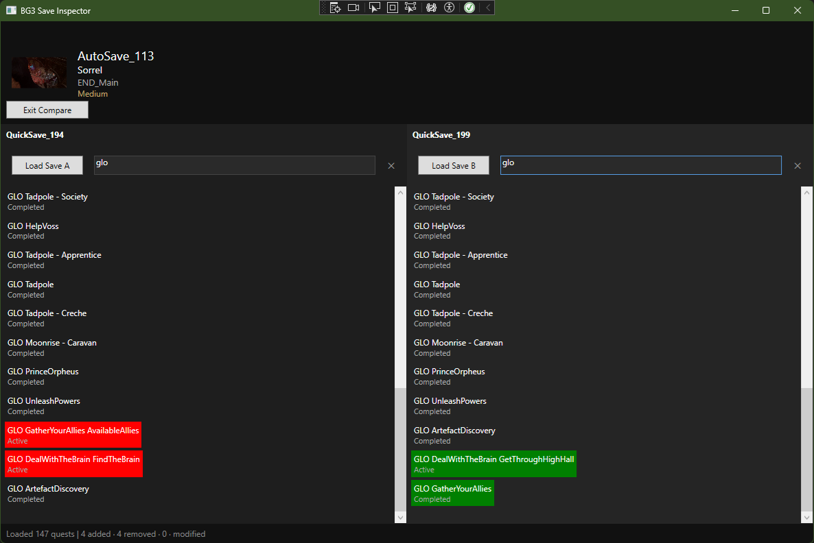
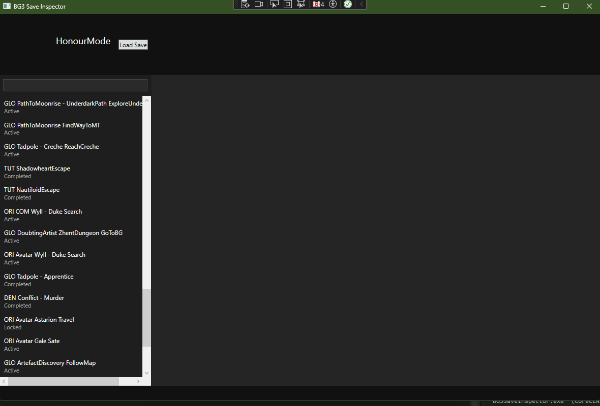
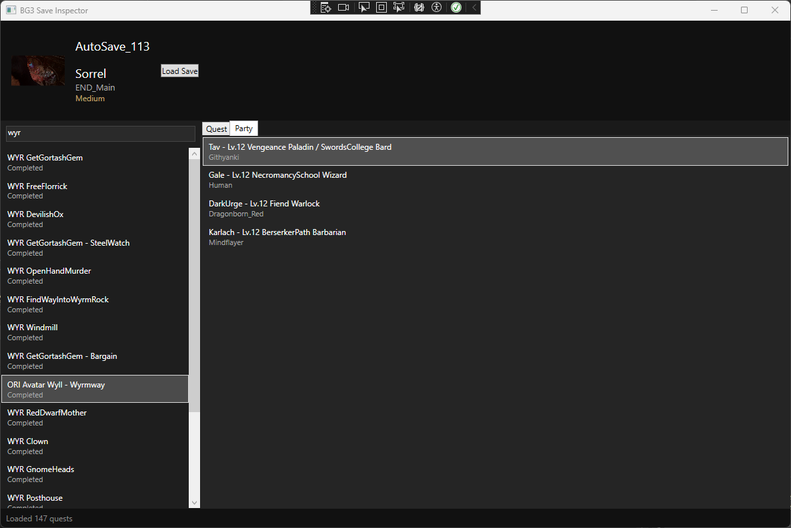

# BG3 Save Inspector
A Windows desktop tool for inspecting Baldur's Gate 3 save files without launching the game. Browse quest states, story flags, and playthrough progress from your '.lsv' save files.

## Features
- Load any BG3 save file (.lsv)
- Browse quest log with objective and stepID
- Diff tool, compare two saves side by side with colour highlighting
  - Green: quests added in Save B
  - Red: quests removed in Save B
  - Orange: quests state altered
- Search and filter quests
- Select a quest to view detailed state
- View save metadata - character name, class, difficulty, thumbnail
- Browse active party composition

## Requirements
- Win 10/11
- .NET 8.0
- Baldur's Gate 3

## Download
[Download latest release (Windows x64)](https://github.com/ndngo/BG3SaveInspector/releases/latest)
or build from source, see below

## Building
1. Clone the repo
2. Open 'BG3SaveInspector.sln' in Visual Studio 2022
3. Build and run

## Acknowledgements
- [LSLib](https://github.com/Norbyte/lslib) by [Norbyte](https://github.com/Norbyte) — 
  used for parsing BG3 save files (.lsv) and LSF binary formats. 
  Licensed under the MIT License.
